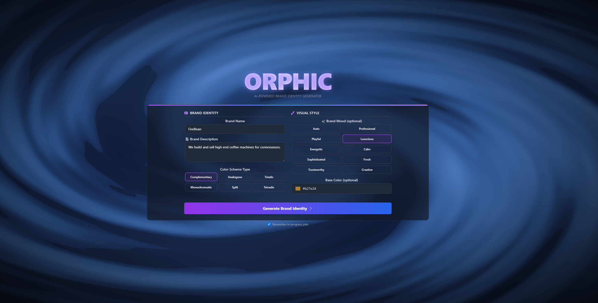
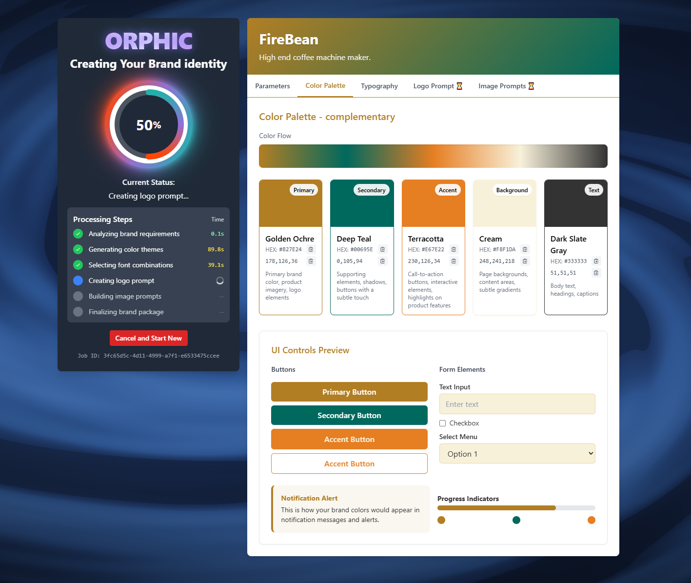

# Orphic - AI-Powered Brand Identity Generator

Orphic is a creative design assistant that takes a brand name and a brief description as input, then automatically generates a comprehensive visual identity package. This package includes a color theme grounded in color harmony theory, a set of three matching typography fonts, a prompt for custom typography-based logo, and three brand-relevant prompts for images.

## Screenshots




## Features

- **Color Theme Generation**: Creates a harmonious color palette based on established color theory principles
- **Font Selection**: Selects three complementary fonts that represent the brand's personality
- **Typography Logo Prompt**: Generates a detailed prompt for typography-focused logo design
- **Image Prompts**: Creates three unique image prompts that align with the brand's identity
- **Real-time Updates**: Provides status updates via Server-Sent Events (SSE)
- **Dynamic Progress Visualization**: Features animated circular progress indicator and task tracking
- **Interactive Interface**: Beautiful UI with animated background effects using Three.js
- **Customizable Inputs**: Specify color scheme types, base colors, and mood preferences

## Tech Stack

### Frontend

- React.js with TypeScript
- Vite for fast development and building
- Tailwind CSS for styling
- Framer Motion for animations
- Three.js for 3D background effects
- EventSource for SSE client

### Backend

- Node.js with Express
- Ollama for AI model access (using Gemma3 12b)
- Server-Sent Events (SSE) for real-time updates

## Application Flow

1. **User Input**: Collect brand name, description, and optional preferences (color scheme, base color, mood)
2. **Color Theme Generation**: AI creates a cohesive color palette with usage recommendations
3. **Font Selection**: AI selects complementary fonts with usage guidelines
4. **Logo Prompt Creation**: AI develops a detailed prompt for typography-focused logo design
5. **Image Prompt Generation**: AI creates three prompts for brand-aligned imagery
6. **Real-time Tracking**: User sees progress updates throughout the generation process
7. **Results Display**: The complete brand identity package is presented with an intuitive interface

## Application Components

### Client Components

- **BrandForm**: Collects brand information and preferences with input validation and a polished UI
- **ResultsDisplay**: Shows generated brand identity elements
- **CircularProgressBar**: Provides visual feedback on overall progress with animated gradient effects
- **ColorfulPerlinNoiseSwirl**: Animated background perlin noise effect
- **StatusPanel**: Displays current generation status
- **TaskList**: Tracks generation progress with visual indicators for completed, in-progress, and pending tasks
- **SkeletonLoading**: Loading placeholders during generation

### Server Services

- **colorTheme.service**: Generates brand color palettes
- **fontSelection.service**: Selects appropriate font pairings
- **logoPrompt.service**: Creates detailed logo design concepts
- **imagePrompt.service**: Generates prompts for brand imagery

## Getting Started

### Prerequisites

- Node.js (v16+)
- npm or yarn
- Ollama with the Gemma3 (12b) model installed or any other model

### Installation

1. Clone the repository

```bash
git clone https://github.com/yourusername/orphic.git
cd orphic
```

2. Install dependencies

```bash
# Install client dependencies
cd client
npm install

# Install server dependencies
cd ../server
npm install
```

3. Configure environment
   Create a `.env` file in the server directory with necessary configuration.

4. Start the application

```bash
# Start the server (from server directory)
npm run dev

# Start the client (from client directory)
npm run dev
```

## Usage

1. Fill in the brand form with your brand name and description
2. Optionally select a color scheme type, base color, and mood
3. Click "Generate Brand Identity" to start the process
4. Watch the real-time progress as your brand elements are created
5. View and export your completed brand identity elements

## Project Structure

```
orphic/
├── client/                # Frontend React application
│   ├── public/            # Static assets
│   ├── src/
│   │   ├── components/    # React components including:
│   │   │   ├── BrandForm.tsx            # Input form for brand details
│   │   │   ├── CircularProgressBar.tsx  # Animated progress indicator
│   │   │   ├── ColorfulPerlinNoiseSwirl.tsx # Three.js background effect
│   │   │   ├── ResultsDisplay.tsx       # Shows generated brand identity
│   │   │   ├── SkeletonLoading.tsx      # Loading placeholders
│   │   │   ├── StatusPanel.tsx          # Shows generation status
│   │   │   └── TaskList.tsx             # Tracks completed/in-progress tasks
│   │   ├── hooks/         # Custom React hooks
│   │   ├── styles/        # Global styles
│   │   ├── App.tsx        # Main application component
│   │   └── ...
│   └── ...
├── server/                # Backend Node.js application
│   ├── src/
│   │   ├── controllers/   # API controllers
│   │   │   └── brand.controller.js  # Orchestrates the generation process
│   │   ├── routes/        # API routes
│   │   ├── services/      # Business logic
│   │   │   ├── colorTheme.service.js    # Generates color schemes
│   │   │   ├── fontSelection.service.js # Selects font pairings
│   │   │   ├── logoPrompt.service.js    # Creates logo design concepts
│   │   │   └── imagePrompt.service.js   # Generates image prompts
│   │   └── index.js       # Entry point
│   └── package.json       # Server dependencies
└── ...
```

## License

[MIT License](LICENSE)

## Acknowledgements

- Gemma3 model by Google
- Ollama for local AI model hosting
- Three.js for 3D graphics
- All open-source contributors
